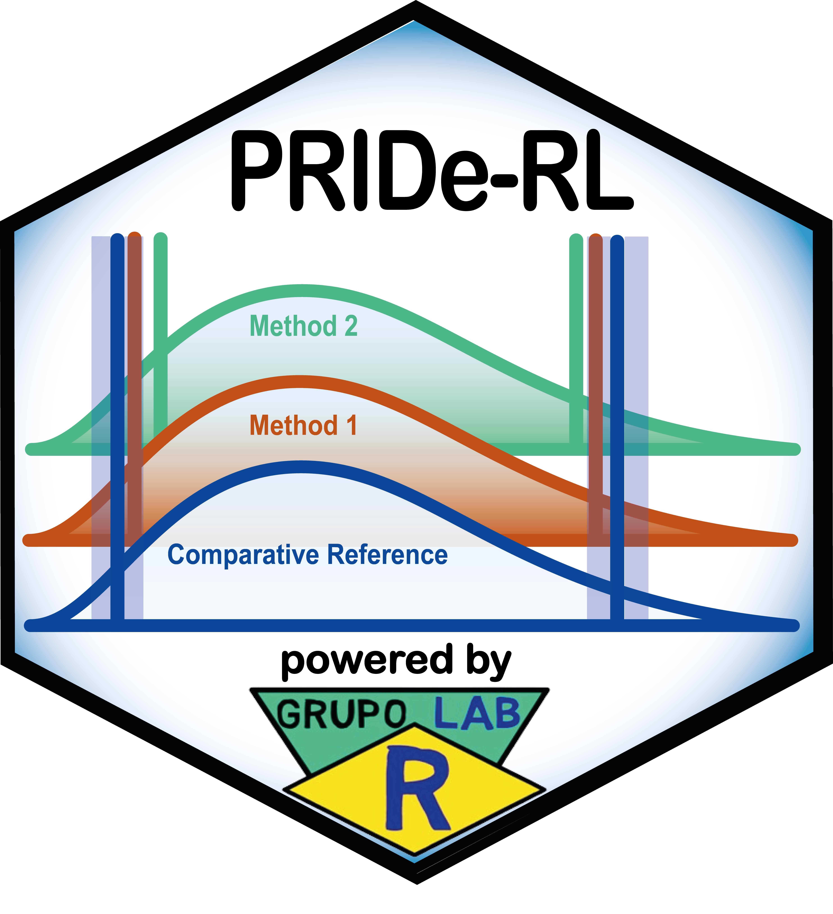

# PRIDe-RL Shiny Application

[](https://www.gnu.org/licenses/gpl-3.0.en.html)
[](https://github.com/labrgrupo/PRIDe-RL_shiny/commits/main)
[](https://github.com/labrgrupo/PRIDe-RL_shiny/releases/latest)



The **PRIDe-RL Shiny Application** implements the **Performance Ranking by Index of Deviation of Reference Limits (PRIDe-RL)** framework for the comparative evaluation and ranking of methods that estimate lower and upper reference limits.

The application compares each estimated reference limit with a user-defined **comparative reference limit**, calculates permissible-difference-based **equivalence intervals**, derives the **reference limit deviation index** (`D_RL`), displays the results in a heatmap, and summarizes method performance through direct and multidimensional rankings.

This repository contains the **local desktop implementation**. It runs on the user's computer through R and RStudio and can retain the complete analysis configuration, a 600 dpi heatmap, and a self-contained HTML report in local output folders.

> A complementary **cloud-ready implementation** for Posit Connect, Posit Cloud, and institutional Shiny servers is available at [**PRIDE-RL_shiny_connect**](https://github.com/labrgrupo/PRIDE-RL_shiny_connect).

---

## Main capabilities

- comparison of two or more reference-limit estimation methods;
- support for multiple assessment groups and analytes;
- comparative lower and upper reference limits for each analyte;
- 80% or 90% nominal central coverage of the equivalence interval;
- calculation of the `D_RL` index for every estimated reference limit;
- direct ranking based on inclusion within equivalence intervals;
- multidimensional evaluation through Conformity, Proximity, Tail behaviour, and Severity;
- calculation of the composite PRIDe-RL score;
- combined heatmap exported at 600 dpi;
- self-contained HTML analytical report;
- direct block paste from Excel, Google Sheets, and CSV files opened in spreadsheet software;
- responsive interface for desktop computers, notebooks, tablets, and mobile devices.

---

## PRIDe-RL analytical framework

PRIDe-RL does not estimate reference intervals directly from raw patient results. It evaluates how closely reference limits generated by different estimation methods agree with a specified comparative reference.

For each lower reference limit (`LRL`) and upper reference limit (`URL`), the application calculates an equivalence interval based on the permissible analytical uncertainty associated with that comparative reference limit. Each estimated limit is then expressed on a common normalized scale through the reference limit deviation index:

```text
D_RL = (estimated RL - comparative RL) / permissible difference
```

The main interpretation is:

- `D_RL = 0` indicates agreement with the comparative reference limit;
- `|D_RL| <= 1` indicates inclusion within the equivalence interval;
- `|D_RL| > 1` indicates that the estimate lies outside the equivalence interval;
- the sign indicates whether the estimated limit is below or above the comparative limit.

The distribution of the `D_RL` indices is evaluated through four complementary performance dimensions:

- **d1 — Conformity:** proportion of evaluated limits contained within their equivalence intervals;
- **d2 — Proximity:** overall closeness of the estimated limits to their comparative limits;
- **d3 — Tail behaviour:** behaviour of the upper tail of the absolute deviation distribution;
- **d4 — Severity:** frequency of deviations greater than twice the permissible difference.

The **PRIDe-RL score** integrates these four dimensions into a single measure ranging from 0 to 1. Higher values indicate better overall agreement with the comparative reference limits. The complete equations, variable definitions, methodological notes, and references are included in the application.

---

## Local application download

The ready-to-use local package is distributed through [**GitHub Releases**](https://github.com/labrgrupo/PRIDE-RL-Shiny-v1.17.29/releases). Open the latest release and, under **Assets**, download **`PRIDE-RL-Shiny-v1.17.29.zip`**.

<div align="center">

### Download the latest local release

<a href="https://github.com/labrgrupo/PRIDe-RL_shiny/releases/latest/download/PRIDe-RL-Shiny.zip">
  
</a>

</div>

The release page contains a quick installation guide. The downloaded package includes a beginner-oriented tutorial in the **`Read_Me/`** folder in Markdown, R Markdown, and PDF formats.

Do not download GitHub's automatically generated **Source code** archives if you want the ready-to-use package. Use the file named **`PRIDe-RL-Shiny.zip`** under **Assets**.

---

## Live web demonstration

A public demonstration of the cloud-ready implementation is available on Posit Connect Cloud:

<div align="center">

<a href="https://labrgroup-pride-rl.share.connect.posit.cloud/" target="_blank">
  
</a>

</div>

The public web deployment is intended for demonstration and training. Do not enter confidential, identifiable, or institutionally restricted information in the public version.

---

## Local application vs. cloud-ready implementation

The two implementations use the same analytical framework and generate equivalent analytical results. They differ primarily in deployment and output management.

| Feature | PRIDe-RL Shiny Application | PRIDE-RL_shiny_connect |
|---|:---:|:---:|
| Primary use | Local desktop analysis | Web or institutional deployment |
| Runs on the user's computer | Yes | Optional |
| Requires R and RStudio for the end user | Yes | No, when already deployed |
| Designed for Posit Connect or Posit Cloud | No | Yes |
| Browser access through a public web address | No | Yes |
| Saves the complete configuration locally | Yes | No persistent server copy |
| Automatically saves the 600 dpi heatmap | Yes | No persistent server copy |
| Automatically saves the HTML report | Yes | No persistent server copy |
| Allows manual HTML-report download | Yes | Yes |
| Uses session-specific temporary files | No | Yes |
| Suitable for multi-user access | No | Yes |

### Local desktop version

The local version is recommended for individual analytical work, reproducible desktop workflows, larger analyses without public-cloud session constraints, and automatic retention of outputs. It requires R, RStudio, and the packages listed in `Install_packages.Rmd`.

### Cloud-ready version

The [**PRIDE-RL_shiny_connect**](https://github.com/labrgrupo/PRIDE-RL_shiny_connect) version is intended for deployment on Posit Connect, Posit Cloud, or an institutional Shiny server. It operates in session-based mode, does not permanently store user outputs in the server directory, and allows the generated HTML report to be downloaded manually.

### Public web version

The public web version is a deployed demonstration of the cloud-ready implementation. End users can access it directly from a browser without installing R or RStudio. Because it is a public demonstration environment, it should not be used with confidential or identifiable information.

---

## Repository contents

- **`app.R`** — Shiny interface, analytical calculations, rankings, heatmap, methodological documentation, references, and HTML-report generator.
- **`Install_packages.Rmd`** — checks and installs the packages required to run the local application.
- **`Read_Me/`** — complete beginner-oriented installation and user guide in Markdown, R Markdown, and PDF formats.
- **`1_Outputs/`** — destination for saved configurations, generated HTML reports, and exported figures.
- **`logo_PRIDe-RL.png`** — logo displayed on this GitHub page.

The application logo and high-resolution scoring-framework figure displayed inside the Shiny interface and HTML report are embedded directly in `app.R` as Base64 data.

---

## Quick start

1. Open the [latest release](https://github.com/labrgrupo/PRIDe-RL_shiny/releases/latest).
2. Under **Assets**, download **`PRIDe-RL-Shiny.zip`**.
3. Extract the complete ZIP file.
4. Follow the tutorial included in the **`Read_Me/`** folder.
5. Install the required packages through `Install_packages.Rmd`.
6. Open `app.R` in RStudio and click **Run App**.

---

## Important use statement

PRIDe-RL is intended for research, method comparison, and laboratory quality-assurance activities. Results must be interpreted by qualified professionals together with the analytical, biological, and clinical context.

The application is not intended to make individual diagnostic decisions or replace professional judgment.

---

## Contact

**Suggestions and bug reports:**  
[https://github.com/labrgrupo/PRIDe-RL_shiny/issues](https://github.com/labrgrupo/PRIDe-RL_shiny/issues)

**Email:**  
[alancdias@hotmail.com](mailto:alancdias@hotmail.com) · [labrgrupo@gmail.com](mailto:labrgrupo@gmail.com)

**Lab R Group website:**  
[https://grupolabr.com/](https://grupolabr.com/)

---

## License

Distributed under the **GNU General Public License v3.0 (GPL-3.0)**.
